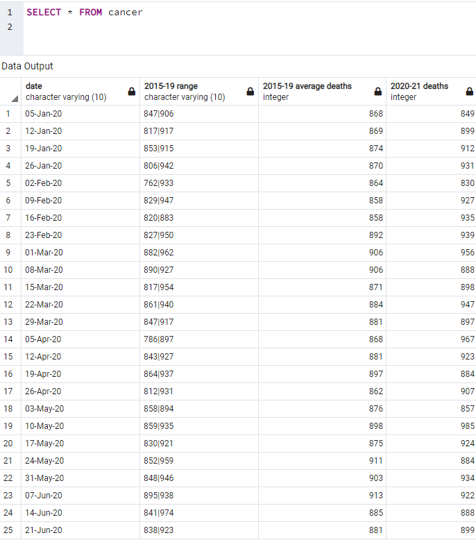

# ETL-Project: Extract - Transform- Load Data

# A Provisional Mortality Statistics ETL Report
##               By Jack Pan and Heriawan Muhamad

## Motivation
The reason we chose this data set is to provide assistance in the development of public policy and the allocation of government recourses between health care and social services. Mortality rate comparisons and the different cause of deaths allows a federal government department to have a better understanding of the trends across the different causes of deaths. The COVID-19 data in our database also allows the department visualize the trends before and after COVID-19 to better plan and allocate resources.
Our cause for our transformations was to be able to interpret mortality statistics more easily between leading causes of death. As well as providing summary statistics on mortality counts and differences to understand the trends that are happening over time. 
Presenting the data in a relational database would be the most effective way of reading and analysing the data.

## Extract
A total of nine raw datasets were extracted from the Australian Bureau of Statistics all relating to provision mortality statistics pre and post COVID-19. The data sets are in csv format. Eight of the datasets used had mortality statistics relating to leading causes of death as certified by a doctor:
Cancer – Provisional mortality stats for cancer as the cause of death from years 2015 to 2021
Cerebrovascular disease – Provisional mortality stats for Cerebrovascular disease as the cause of death from years 2015 to 2021
Chronic lower respiratory disease – Provisional mortality stats for Chronic lower respiratory disease as the cause of death from years 2015 to 2021
Dementia – Provisional mortality stats for Dementia as the cause of death from years 2015 to 2021
Diabetes – Provisional mortality stats for Diabetes as the cause of death from years 2015 to 2021
Heart disease – Provisional mortality stats for Heart disease as the cause of death from years 2015 to 2021
Pneumonia – Provisional mortality stats for Pneumonia as the cause of death from years 2015 to 2021
Respiratory disease – Provisional mortality stats for Respiratory disease as the cause of death from years 2015 to 2021
Total deaths – this dataset aggregated these mortality statistics into a total count for each period.
They were imported into a PgAdmin4 SQL database with ‘date’ being the primary key to form a relationship between all the datasets. SQL alchemy was then utilised to facilitate data transformation within the database on Jupyter Notebook.

## Transform
Before we could extract the csv datasets into a PgAdmin4 database, we had to go into the csv files to change cell formats to exclude commas. Such that when importing, the values could be interpreted is integers.
Once the database was connected on Jupyter we could start transformations:
1.	Got rid of any NaN values and replaced them with 0 (within the COVID column)
2.	For each of the initial tables we added a ‘total change’ and ‘percent total change’ columns to visualise the difference between 2015-19 and 2020-21
3.	Rounded the calculations done in part 2 to make it look visually cleaner
4.	Renamed corresponding columns for the initial tables to make it clearer when performing joins
5.	Created two new tables named ‘death_summary…’ to aggregate total deaths for each cause of death for 2015-19 then 2020-21. These tables will be useful in comparing the composition of total deaths within single tables in the total formt.
6.	The making of the tables required transposing to be visually consistent with initial tables
7.	Calculations were done to find total deaths of a cause as a percentage of total deaths for each period (2015-19 and 2020-21)
8.	Created a second pair of tables called ‘perc_death_summary…’ to aggregate percentage of total deaths for each cause of death for 2015-19 then 2020-21.  This table will be useful to compare the composition of total deaths within single tables in the percent format.
9.	The creation of the tables from part 8 involved changing the data type of the columns except date to numeric to allow for the values to be rounded to 2 decimal places. It also involved transposing.
10.	Rounded the values of the tables from part 8 to make them look visually appealing.

## Load
After all transformation were completed. We loaded the dataframes into an SQL database. The reason we chose a relational database is because of how the data is presented. We feel a relational database is the best way to view the data for analysis. A primary key can easily be assigned to all tables because of a common ‘date’ column in all the tables.
From the transformation process we have created these 9 tables within the SQL database;
### | cancer |
### | cerebrovasuclar_disease            |                
### | chronic_lower_respiratory_disease  |                
### | dementia                           |
### | diabetes                           |   
### | heart_disease                      |
### | pneumonia                          |   
### | respiratory_disease                |               
### | total                              |
### | Deaths_Summary2015_19              |
### | Deaths_Summary2020_21              |
### | perc_Deaths_Summary2015_19         |
### | perc_Deaths_Summary2020_21         |

## First Table (Cancer)

We started the loading process by:
1.	Creating the tables in our SQL database 
2.	Using python to convert each dataframe and upload them into the corresponding table in SQL
